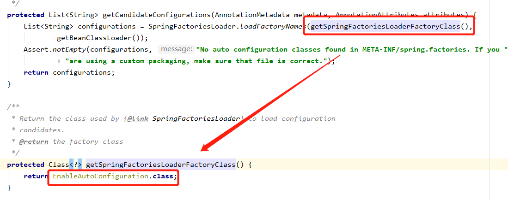
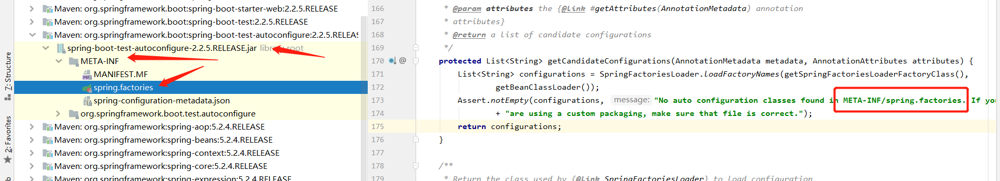
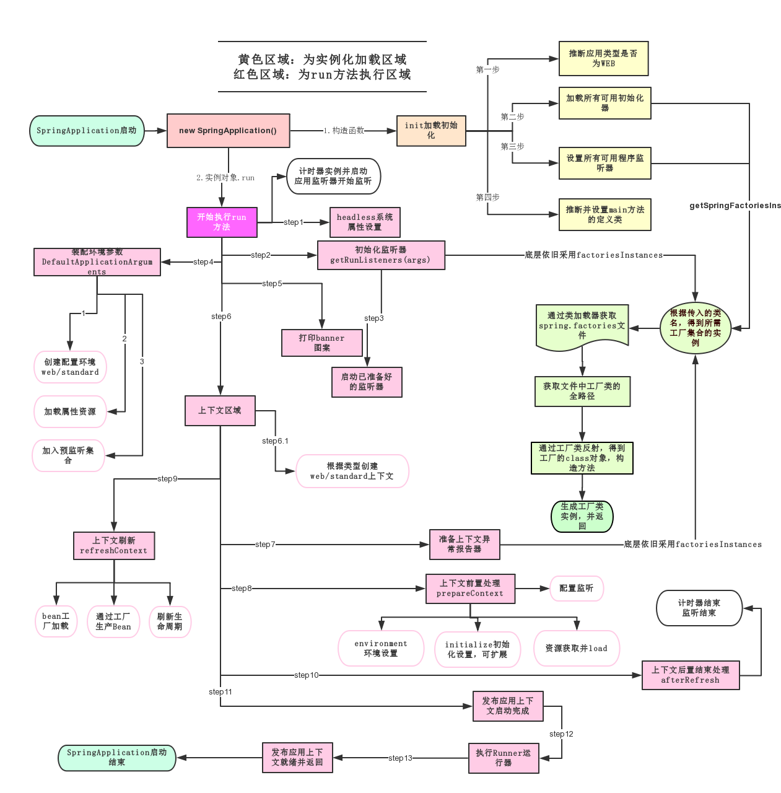
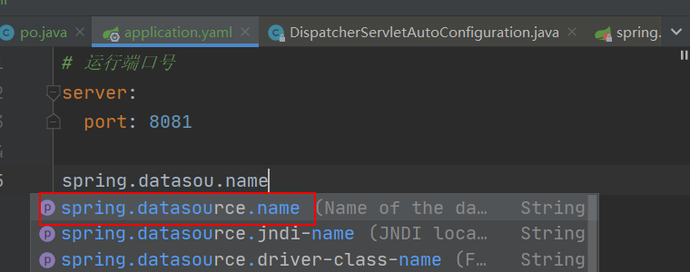
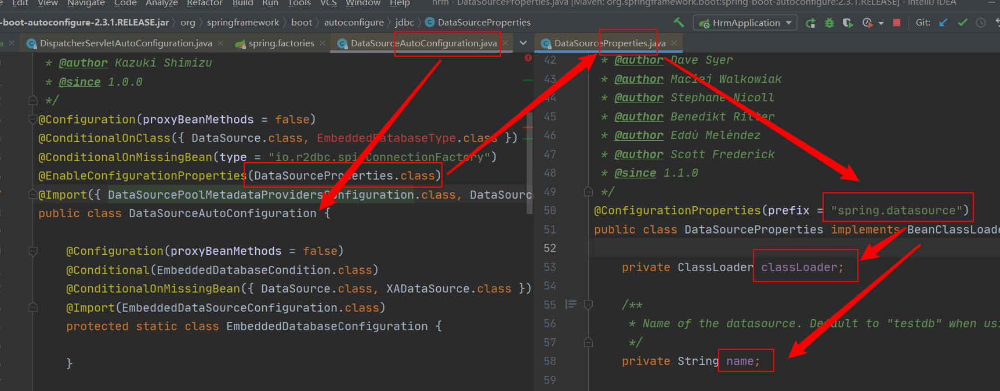
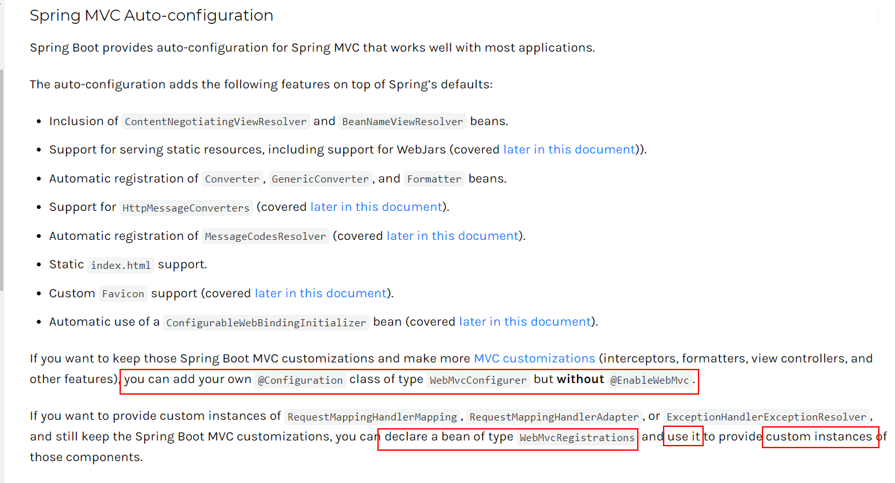

# 原理初探

自动配置：

## **pom.xml**

* spring-boot-dependencies : 核心依赖在父工程中！
* 我们在写或者引入一些spring boot依赖时，不需要指定版本，就因为有这些版本的仓库，已经默认定义。


## **启动器**

* ```xml
  <dependency>
      <groupId>org.springframework.boot</groupId>
      <artifactId>spring-boot-starter</artifactId>
  </dependency>
  ```

* 启动器：说白了就是Spring boot的启动场景；
* 比如spring-boot-starter-web，他就会帮我们自动导入web环境所有的依赖！
* Spring boot会将所有的功能场景，都变成一个个的启动器
* 我们要使用什么功能，就只需要找到对应的启动器就可以了。  

## **主程序**

```java
//@SpringBootApplication ：标注这个类是一个spring boot的应用
@SpringBootApplication
public class SpringbootApplication {

    public static void main(String[] args) {
        SpringApplication.run(SpringbootApplication.class, args);
    }

}
```

* 注解

  * ```java
    @SpringBootConfiguration :  springboot 的配置
        @Configuration ： spring 配置类
        	@Component ： 是一个sping 组件
        
    @EnableAutoConfiguration ： 自动配置
        @AutoConfigurationPackage ： 自动配置包
        	@Import(AutoConfigurationPackages.Registrar.class) ： 自动配置包
        @Import(AutoConfigurationImportSelector.class) ： 自动配置导入选择器
     // 获取所有的配置
        List<String> configurations = getCandidateConfigurations(annotationMetadata, attributes);
        
    ```

    

    自动配置核心文件：META-INF/spring.factories

    

    ```java
    Properties properties = PropertiesLoaderUtils.loadProperties(resource);
    ```

1. ###### springboot在启动的时候，从类路径下 /META-INF/**<u>spring.factories</u>** 获取指定的值；

2. 将这些自动配置的类导入容器，自动配置就会生效，帮助我们进行自动配置！

3. 以前我们需要自动配置的东西，现在spring boot帮我们做了

4. 整合javaEE，解决方案和自动配置的东西都在org.springframework.boot:spring-boot-autoconfigure:2.2.5.RELEASE.jar 这个包下META-INF/spring.factories

5. 它会将所有需要导入的组件，以类名的方式返回，这些组件就会被添加到容器

6. 容器中也会存在非常多的的xxxAutoConfiguration的文件(就是一些@Bean），就是这些类给容器导入了这个场景需要的所有组件并自动配置。（Bean里面用了@Configuration自动装配注解）

7. 有了自动配置类，免去了我们手动编写配置文件的工作。

   ```sequence
   Title:springboot自动装配原理初探
   main入口-->@SpringBootApplication: 装配
   Note right of main入口: 编注这是一个\n Springboot应用
   Note right of @SpringBootApplication: 实际是一个接口\n 装配了以下三个@注解
   @SpringBootApplication-->@SpringBootConfiguration: springboot配置
   @SpringBootApplication-->@EnableAutoConfiguration: 自动装配
   @SpringBootApplication-->@ComponentScan: 部件扫描
   Note left of Configuration: Configuration注解了\n @Component部件
   @SpringBootConfiguration-->>Configuration: 实现了该接口
   @EnableAutoConfiguration-->@AutoConfigurationPackage: 加载自动配置包
   @EnableAutoConfiguration-->@Import:  (导入AutoConfigurationImportSelector.class)自动配置导入启动器
   @AutoConfigurationPackage-->@Import: (导入AutoConfigurationPackages.Registrar.class)
   Note right of @Import: 注册器中含两个方法：\n 类定义注册(metadata,registry) \n 和 确定导入(metadata);
   @Import->AutoConfigurationPackages类: 导入注册器类，将配置存进配置包类中
   Note left of AutoConfigurationImportSelector类: getAutoConfigurationEntry方法\n拥有一个List类型属性configurations调用了getCandidateConfigurations方法。
   Note right of AutoConfigurationImportSelector类: getCandidateConfigurations方法\n调用了SpringFactoriesLoader类的loadFactoryNames方法，\n加载了META-INF/spring.factories资源。
   @Import->AutoConfigurationImportSelector类: 导入自动装配导入选择器。
   participant spring.factories
   AutoConfigurationImportSelector类->spring.factories: 加载资源文件（该文件是一个类库）
   ```

# SpringApplication

   这个类主要做了以下四件事：

   1. 推断应用的类型是普通的项目还是Web项目
   2. 查找并加载所有可用初始化器 ， 设置到initializers属性中
   3. 找出所有的应用程序监听器，设置到listeners属性中
   4. 推断并设置main方法的定义类，找到运行的主类

   

# 配置文件

## 推荐使用的格式 yaml

spring boot配置文件```application.properties```，到底可以配置哪些东西？

官方不推荐使用```application.properties```而是使用```application.yaml```,文件名必须是<u>**application**</u>开头

* **yaml 格式的配置文件更为灵活：**

  * 支持离散性赋值

  * 支持数据检验（validated）

  * 支持批量赋值

  * 基本语法：

    ​		key:空格value     //  缩进代表属于子属性。

   ```yaml
   server:
     port: 8081
  
   # 普通的key-value
   name: qinjiang
  
   # 对象
   student:
     name: qinjiang
     age: 3
  
   # 行内写法
   student2: {name: qinjiang,age: 3}
  
   # 数组
   pets:
     - cat
     - dog
     - pig
   pets2: [cat,dog,pig]
   ```

1. application可以存在于四个地方，**优先级依次**为：
   1. file/config

   2. file/./

   3. classpath/config

   4. classpath/./   (官方默认生成的就在这里，优先级最低)

   可以在配置文件中，选择激活不同配置文件来激活不同的环境：

   ```yaml
   # springboot的多环境配置：可以使用选择激活哪一个配置文件。
   spring:
     profiles:
       active: dev [| test | pro ...]
   ```


2. 也可以利用 **yaml** 的特性，在同个配置文件配置多个**文档块**不同的环境：

   ```yaml
   # 通过 --- 分割不同的文档块
   # springboot多环节配置
   # 如果没有指定 active ，则默认激活第一个文档块
   spring:
         profiles:
           active: default
   ---
   spring:
     profiles: default
   
   server:
     port: 8080
   ---
   spring:
     profiles: test
   server:
     port: 8081
   ---
   spring:
     profiles: dev
   server:
     port: 8082
   ```
   
   ```java
   /*
   * 使用yaml的配置文件
   * 在类上面加一个@configurationProperties(prifix = "person")
   * 也可以使用properties
   **/
   @Compenent
   @configurationProperties(prefix = "person")
   public class Person{
       String fistName;
   }
   
   
   ////////////////////
   // application.yaml
   person:
   	firstName: 名字	
   
   //这相当于松散绑定，-对应驼峰命名
   ---
   person:
   	first-name: 名字		
        
   ```
   
   


## 配置文件自动配置的原理

**精髓：**

1. spring boot启动会加载大量的自动配置类（类的清单在/META-INF/**<u>spring.factories</u>** ）

2. 我们看我们需要的功能有没有在spring boot默认写好的自动配置类当中

3. 我们再来看这个自动配置类中到底配置了哪些组件（只要我们要用的组件存在在其中，我们就不需要再手动配置了）

4. 给容器中自动配置类添加组件的时候，会从**properties类**中获取某些属性。我们只需要再配置文件中指定这些属性的值即可。（也就是说，在配置文件中可以指定的属性是与properties类的属性是相对应的）

   **xxxAutoConfiguration: 自动装配类**；给容器中添加组件

   **xxxProperties:封装配置文件中相关的属性**
   
   
   
   

# SpringBoot Web开发

* 开发前，回顾一下。springboot开发后是生成一个jar包，是线程级运行。
* 因为自动装配引发的思考：
  * spring boot到底帮我们配置了什么？
  * 我们能不能修改？
  * 能修改哪些东西？
  * 能不能扩展？

* 要解决的问题：
  * 导入静态资源（html、css怎么导入？）
  * 默认没有首页，怎么解决？
  * jsp 文件位置，模板引擎 Thymeleaf
  * 装配和扩展SpringMVC 
  * 增删改查
  * 拦截器
  * 国际化！

## 静态资源

WebMvcAutoConfiguration包中的一个方法：
```java
public void addResourceHandlers(ResourceHandlerRegistry registry) {
    if (!this.resourceProperties.isAddMappings()) {
        logger.debug("Default resource handling disabled");
        return;
    }
    Duration cachePeriod = this.resourceProperties.getCache().getPeriod();
    CacheControl cacheControl = this.resourceProperties.getCache().getCachecontrol().toHttpCacheControl();
// 如果注册了webjars包，也就是pom中导入了该包
    if (!registry.hasMappingForPattern("/webjars/**")) {
//handler就是控制器，意思是增加一个控制器webjars，
        //映射到本地的/META-INF/resources/webjars路径
 customizeResourceHandlerRegistration(registry.addResourceHandler("/webj      ars/**")
                                             .addResourceLocations("classpath:/META-INF/resources/webjars/")
                                             .setCachePeriod(getSeconds(cachePeriod)).setCacheControl(cacheControl));
    }
    String staticPathPattern = this.mvcProperties.getStaticPathPattern();
    if (!registry.hasMappingForPattern(staticPathPattern)) {
        customizeResourceHandlerRegistration(registry.addResourceHandler(staticPathPattern)
                                             .addResourceLocations(getResourceLocations(this.resourceProperties.getStaticLocations()))
                                             .setCachePeriod(getSeconds(cachePeriod)).setCacheControl(cacheControl));
    }
}
```


ResourceProperties类中：


```java
@ConfigurationProperties(prefix = "spring.resources", ignoreUnknownFields = false)
public class ResourceProperties {

	private static final String[] CLASSPATH_RESOURCE_LOCATIONS = { "classpath:/META-INF/resources/",
			"classpath:/resources/", "classpath:/static/", "classpath:/public/" };

	/**
	 * Locations of static resources. Defaults to classpath:[/META-INF/resources/,
	 * /resources/, /static/, /public/].
	 */
```

根据以上可以得出：

1. 在spring boot，我们可以使用以下方式处理静态资源
   * webjars  ```localhost:8080/webjars/```
   * resources ,  static  ,  public      ```localhost:8080/```
2. 优先级： resources >  static  >  public

## 首页定制

1. 静态页面

```java
public WelcomePageHandlerMapping welcomePageHandlerMapping(ApplicationContext applicationContext,
      FormattingConversionService mvcConversionService, ResourceUrlProvider mvcResourceUrlProvider) {
   WelcomePageHandlerMapping welcomePageHandlerMapping = new WelcomePageHandlerMapping(
         new TemplateAvailabilityProviders(applicationContext), applicationContext, getWelcomePage(),
         this.mvcProperties.getStaticPathPattern());
   welcomePageHandlerMapping.setInterceptors(getInterceptors(mvcConversionService, mvcResourceUrlProvider));
   return welcomePageHandlerMapping;
}

private Optional<Resource> getWelcomePage() {
    //这里获取路径，从resourceProperties获取，也就是那三个静态资源目录
   String[] locations = getResourceLocations(this.resourceProperties.getStaticLocations());
   return Arrays.stream(locations).map(this::getIndexHtml).filter(this::isReadable).findFirst();
}

private Resource getIndexHtml(String location) {
    
   //从这一行代码可以知道，默认首页是 路径/index.html   所以index默认情况下放在三个静态资源目录下
   return this.resourceLoader.getResource(location + "index.html");
}
```

2. 使用 Thymeleaf

使用模板引擎来定制动态页面。jsp就是一种模板引擎，而spring boot官方推荐使用 **Thymeleaf** 

使用时需要导入依赖，即Thymeleaf 的启动器

//  在使用springboot 较低版本时（2.x以前），需要指定版本是2.x的Thymeleaf

```xml
<dependency>
  <groupId>org.thymeleaf</groupId>
  <artifactId>thymeleaf</artifactId>
</dependency>
```

接下来看一下 Thymeleaf 的自动装配属性

```java
@ConfigurationProperties(prefix = "spring.thymeleaf")
public class ThymeleafProperties {

   private static final Charset DEFAULT_ENCODING = StandardCharsets.UTF_8;
//前缀
   public static final String DEFAULT_PREFIX = "classpath:/templates/";
//后缀
   public static final String DEFAULT_SUFFIX = ".html";
```

可以发现 classpath:/templates 相当于 SpringMVC 里面的 WEB-INF/jsp 目录

### **Thymeleaf 语法**

* **Simple expressions:**
  *  **Variable Expressions:** ${...} 
  * **Selection Variable Expressions:** *{...} 
  * **Message Expressions:** #{...} 
  * **Link URL Expressions:** @{...} 
  * **Fragment Expressions:** ~{...} 
* **Literals** 
  * **Text literals:** 'one text' , 'Another one!' ,… 
  * **Number literals:** 0 , 34 , 3.0 , 12.3 ,… 
  * **Boolean literals:** true , false 
  * **Null literal:** null 
  * **Literal tokens:** one , sometext , main ,… 
* **Text operations:** 
  * **String concatenation:**   + 
  * **Literal substitutions:**  |The name is ${name}| 
* **Arithmetic operations:** 
  * **Binary operators:** + , - , * , / , % 
  * **Minus sign (unary operator):**  - 
* **Boolean operations:** 
  * **Binary operators:** and , or 
  * **Boolean negation (unary operator):**   ! , not 
* **Comparisons and equality:** 
  * **Comparators:** > , < , >= , <= ( **gt , lt , ge , le** ) 
  * **Equality operators:** == , != ( **eq , ne** ) 
* **Conditional operators:** 
  * **If-then:** (if) ? (then) 
  * **If-then-else:** (if) ? (then) : (else) 
  * **Default:** (value) ?: (defaultvalue) 
* **Special tokens:** 
  * **No-Operation:**  _

**<u>All these features can be combined and nested</u>**

## SpringMVC 拓展

[官方文档](https://docs.spring.io/spring-boot/docs/current/reference/htmlsingle/#boot-features-spring-mvc-auto-configuration)



示例：

```java
@Configuration
public class MyConfig implements WebMvcConfigurer {

    /* If you want to provide custom instances of RequestMappingHandlerMapping，
    *  declare a bean of type （ViewResolver....） and use it to provide custom instances of those components.
    *  从官方文档这一句描述知道，拓展mvc 只需要：
    *   1. 自定义一个组件类
    *   2. 实现这个 bean的逻辑
    *   3. 调用时返回这个bean
    * */
    @Bean
    public ViewResolver myViewResolver(){
//        返回这个自定义实例，就是 use it
        return new MyViewResolver();
    }

//    静态类，这时自定义的视图解析器(也就是上文说的custom instances用户实例 )
    public static class MyViewResolver implements ViewResolver{

        @Override
        public View resolveViewName(String viewName, Locale locale) throws Exception{
            return null;
        }
    }
}
```

